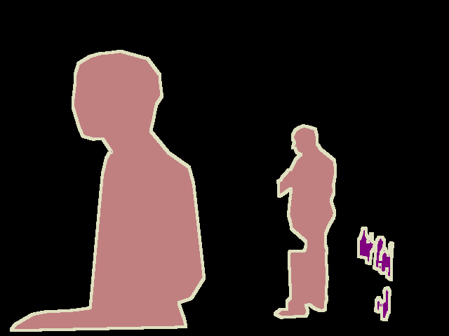

# coco2voc-Segmentation
A tool for converting COCO style annotations to PASCAL VOC style segmentations with borders

Use this to convert the COCO style JSON annotation files to PASCAL VOC class segmentations in a PNG format. This can be useful when some preprocessing (cropping, rotating, etc.) is required, where it is more convenient to have the labels as images as well.

# Requirements  

```shell
pip install Pillow
pip install pycocotools
pip install opencv-python
pip install tqdm
```
Also, the method does not download the COCO images but instead assumes they exist locally.

# Sample

This tool will generate VOC dataset with borders.

  
